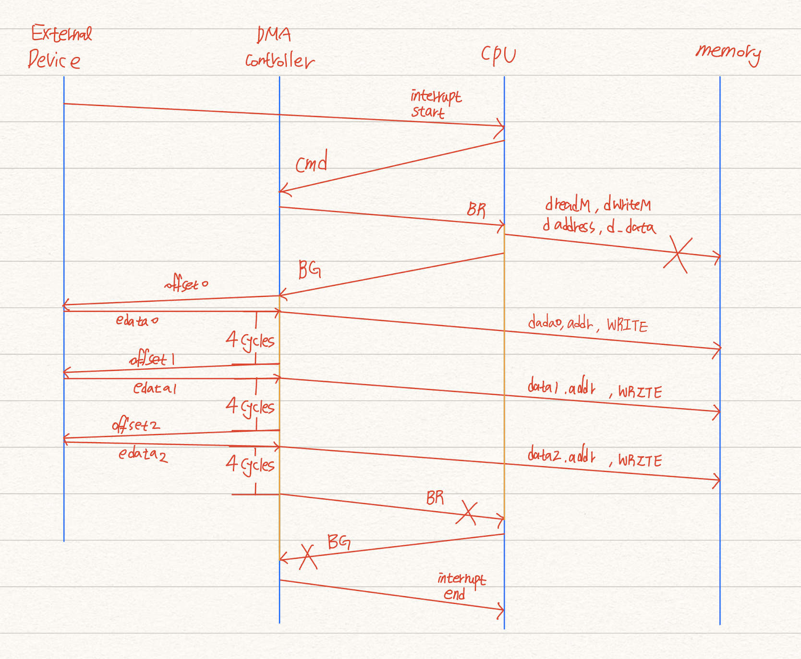

# dma

- In this design, the DMA engine releases the bus after sending 4 words.
- As a result, the stalled-CPU can execute instructions.
- If the CPU does not use the memory bus, the DMA controller should retake the bus as soon as possible.

